# FaceSignIn: Web-Based Biometric Authentication System

## System Overview
FaceSignIn is a web-based biometric authentication system that combines deep learning face recognition with email-based OTP verification for two-factor authentication (2FA). The system was developed by researchers at Brain Station Cyber Hub, Department of Intelligence Computing.

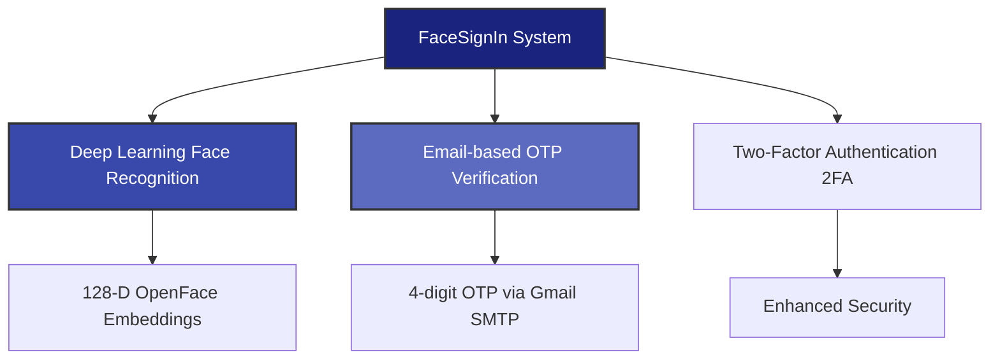

## Core Architecture

### Three-Tier System Architecture:
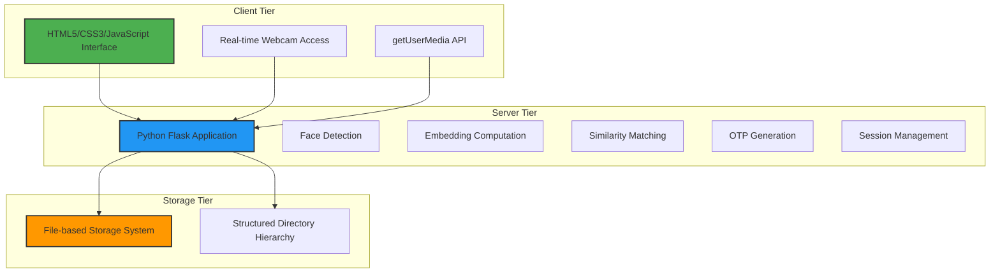

### Directory Structure:
```
┌─────────────────────────────────────────┐
│          Directory Structure            │
├─────────────────────────────────────────┤
│  📁 users/                              │
│     └── Per-user folders with images   │
│         and email data                  │
├─────────────────────────────────────────┤
│  📁 trainer/                            │
│     └── Embeddings and labels          │
├─────────────────────────────────────────┤
│  📁 models/                             │
│     └── OpenFace model file            │
│         (nn4.small2.v1.t7)             │
├─────────────────────────────────────────┤
│  📁 tmp_signup/                         │
│     └── Temporary sign-up data          │
└─────────────────────────────────────────┘
```

## Technical Methodology

### Face Detection Pipeline:
```
┌─────────────────────────────────────────┐
│         Face Detection Process         │
├─────────────────────────────────────────┤
│ 1. Input Image                         │
│ 2. Haar Cascade Classifier             │
│    • scaleFactor=1.1                   │
│    • minNeighbors=4                    │
│ 3. Adaptive Histogram Equalization     │
│ 4. Detect Largest Face                 │
│ 5. Output Bounding Box                 │
└─────────────────────────────────────────┘
```

### Preprocessing Workflow:
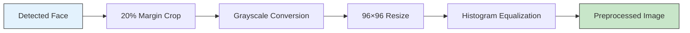

### Embedding Extraction:
| Component | Specification | Purpose |
|-----------|---------------|---------|
| **Model** | OpenFace nn4.small2.v1.t7 | Deep learning face recognition |
| **Method** | OpenCV DNN Module | Neural network inference |
| **Output** | 128-dimensional vector | Face "fingerprint" |
| **Function** | `face_to_embedding()` | Image to embedding conversion |

### Similarity Matching:
```
Cosine Similarity Formula:
        A · B
cosθ = ——————————
       ||A|| ||B||

Where:
  A, B = 128-D embedding vectors
  θ = angle between vectors
  
Decision Threshold:
  • Match: ≥ 0.60
  • No Match: < 0.60
  • Backup: LBPH if OpenFace unavailable
```

## OTP System Specifications:

### OTP Lifecycle Timeline:
```mermaid
gantt
    title OTP Lifecycle Timeline
    dateFormat S
    axisFormat %S s
    
    section OTP Process
    OTP Generation :a1, 0, 1s
    Email Dispatch :a2, after a1, 3s
    User Receives :a3, after a2, 10s
    OTP Entry :a4, after a3, 5s
    Verification :a5, after a4, 1s
    Expiration :a6, after a5, 281s
```

### OTP Timeline Details:
| Step | Time Range | Duration | Description |
|------|------------|----------|-------------|
| **OTP Generation** | 0-1 second | 1s | System generates random 4-digit OTP |
| **Email Dispatch** | 1-4 seconds | 3s | OTP sent via Gmail SMTP with TLS |
| **User Receives** | 4-14 seconds | 10s | Email delivery time (variable) |
| **OTP Entry** | 14-19 seconds | 5s | User inputs received OTP |
| **Verification** | 19-20 seconds | 1s | System validates OTP |
| **Expiration Window** | 0-300 seconds | 300s | Total OTP validity period (5 minutes) |

### OTP Technical Specifications:
```
OTP Characteristics:
┌─────────────────────┬─────────────────────────────┐
│ Parameter           │ Specification               │
├─────────────────────┼─────────────────────────────┤
│ OTP Length          │ 4 digits (0000-9999)       │
│ Validity Period     │ 300 seconds (5 minutes)    │
│ Generation Method   │ Random number generation    │
│ Delivery Method     │ Gmail SMTP with TLS        │
│ Verification Points │ Sign-up and Login          │
│ Security Features   │ Single-use, time-limited   │
└─────────────────────┴─────────────────────────────┘
```

## Workflow Processes

### Sign-Up Process Flowchart:
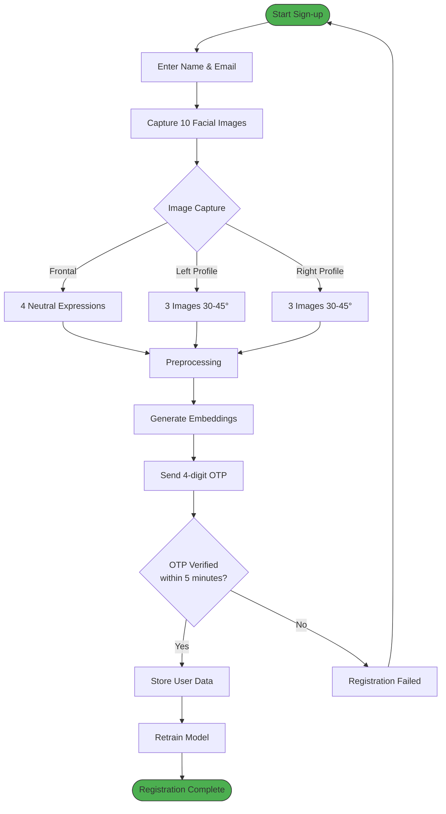

### Login Process:
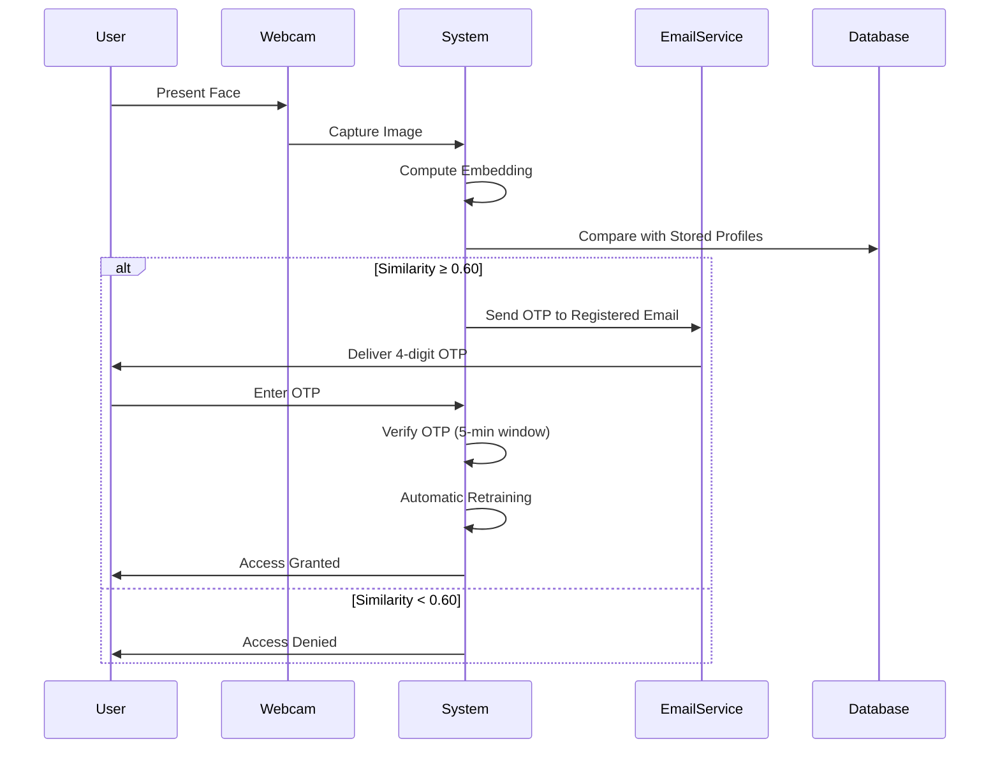

### Pose Capture Distribution:
```
Sign-up Pose Requirements:
┌────────────────┬────────────┬──────────────┐
│ Pose Type      │ Quantity   │ Angle Range  │
├────────────────┼────────────┼──────────────┤
│ Frontal        │ 4 images   │ 0°           │
│ Left Profile   │ 3 images   │ 30-45°       │
│ Right Profile   │ 3 images   │ 30-45°       │
└────────────────┴────────────┴──────────────┘
Total: 10 images per user
```

## Model Training & Retraining
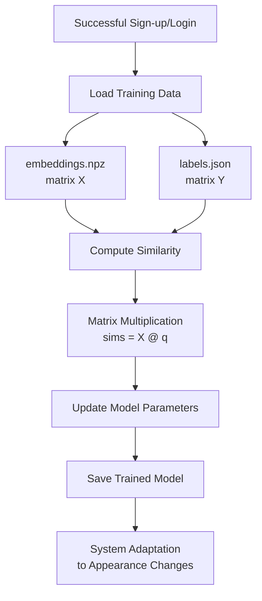

**Key Training Components:**
- **Automatic Retraining**: After each successful authentication
- **Training Files**: 
  - `embeddings.npz` - 128-D vectors matrix (X)
  - `labels.json` - User identity labels (Y)
- **Similarity Computation**: `sims = (X @ q)` where q is query vector

## Performance Metrics

### System Performance Dashboard:
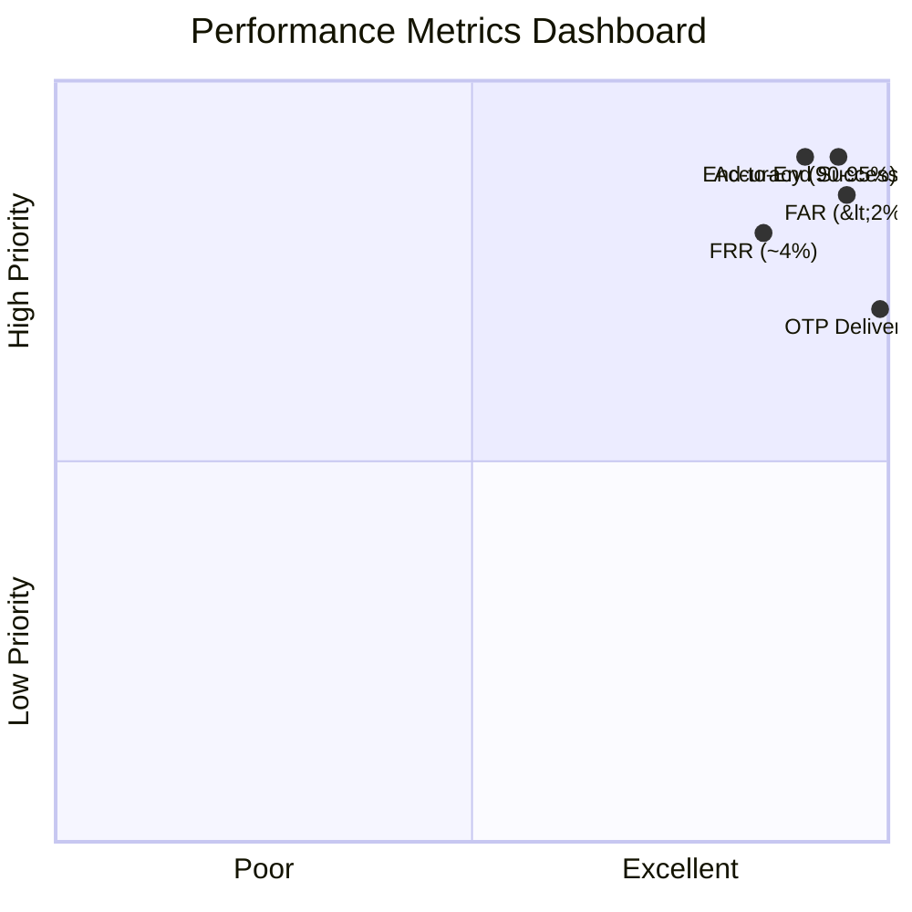

### Detailed Performance Table:
| Metric | Value | Status | Target | Deviation |
|--------|-------|--------|--------|-----------|
| **Face Recognition Accuracy** | 90-95% | ✅ **Excellent** | >90% | ±2.5% |
| **False Acceptance Rate (FAR)** | < 2% | ✅ **Excellent** | <5% | -3% |
| **False Rejection Rate (FRR)** | ~4% | ✅ **Good** | <10% | -6% |
| **OTP Delivery Success Rate** | 99% | ✅ **Excellent** | >95% | +4% |
| **End-to-End Authentication Success** | ~94% | ✅ **Excellent** | >90% | +4% |

### Performance Comparison Chart:
```
Performance Comparison (Higher is Better)
FaceSignIn Accuracy:   ██████████░░ 94%
Industry Average:      ████████░░░░ 80%
Minimum Acceptable:    █████░░░░░░░ 50%
                      0%   25%   50%   75%   100%
```

## Security Features

### Security Architecture:
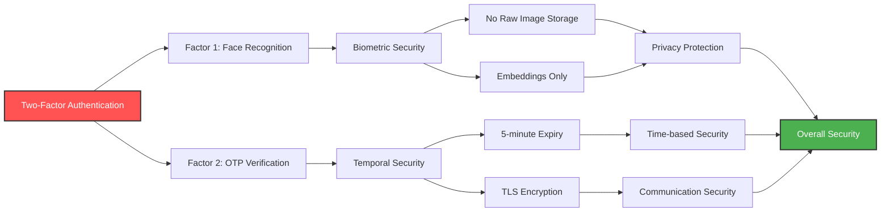

### Security Feature Matrix:
| Security Feature | Implementation | Protection Level | Impact |
|------------------|----------------|------------------|---------|
| **Two-Factor Auth** | Face + OTP | 🔴🔴🔴🔴 High | Primary security layer |
| **Session Management** | Flask Sessions | 🔴🔴🔴 Medium | User state security |
| **No Raw Image Storage** | Embeddings only | 🔴🔴🔴 Medium | Privacy protection |
| **Secure Email** | TLS Encryption | 🔴🔴🔴🔴 High | OTP transmission |
| **OTP Expiration** | 5-minute limit | 🔴🔴🔴 Medium | Time-based security |

## Limitations

### Limitations Analysis Chart:
```
Current System Limitations:
┌─────────────────────────────────────┬─────────────────┐
│ Limitation                          │ Impact Level    │
├─────────────────────────────────────┼─────────────────┤
│ Lack of Liveness Detection          │ ████░░░░ High   │
│ Local File Storage                  │ ████░░░░ High   │
│ Lighting Dependency                 │ ███░░░░░ Medium │
│ Camera Quality Dependency           │ ██░░░░░░ Medium │
│ No Embedding Encryption             │ ███░░░░░ Medium │
└─────────────────────────────────────┴─────────────────┘
```

### Limitations Detail Table:
| Limitation | Description | Impact | Workaround |
|------------|-------------|--------|------------|
| **No Liveness Detection** | Vulnerable to photo spoofing | High | Controlled environment deployment |
| **Local File Storage** | Limits scalability beyond ~1000 users | High | Manual backup and archiving |
| **Lighting Dependent** | Accuracy affected by poor lighting | Medium | User guidance for optimal conditions |
| **Camera Quality Dependent** | Performance varies with hardware | Medium | Minimum 720p camera recommendation |
| **No Embedding Encryption** | Theoretical vulnerability | Medium | File system permissions |

## Future Improvements

### Improvement Roadmap:
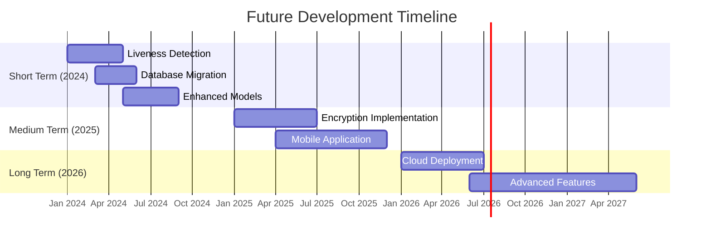

### Future Improvements Matrix:
| Improvement Area | Specific Enhancement | Priority | Expected Impact |
|------------------|----------------------|----------|-----------------|
| **Security** | Blink detection / Challenge-response | 🔴 High | Spoofing prevention |
| **Storage** | SQL/NoSQL database migration | 🔴 High | Scalability improvement |
| **Accuracy** | ArcFace/MobileFaceNet migration | 🟡 Medium | Performance boost |
| **Privacy** | Homomorphic encryption | 🟡 Medium | Data protection |
| **Accessibility** | Cross-platform mobile app | 🔵 Low | User reach expansion |
| **Infrastructure** | AWS/Azure cloud deployment | 🔵 Low | Enterprise readiness |

## Author Contributions

### Contribution Distribution:
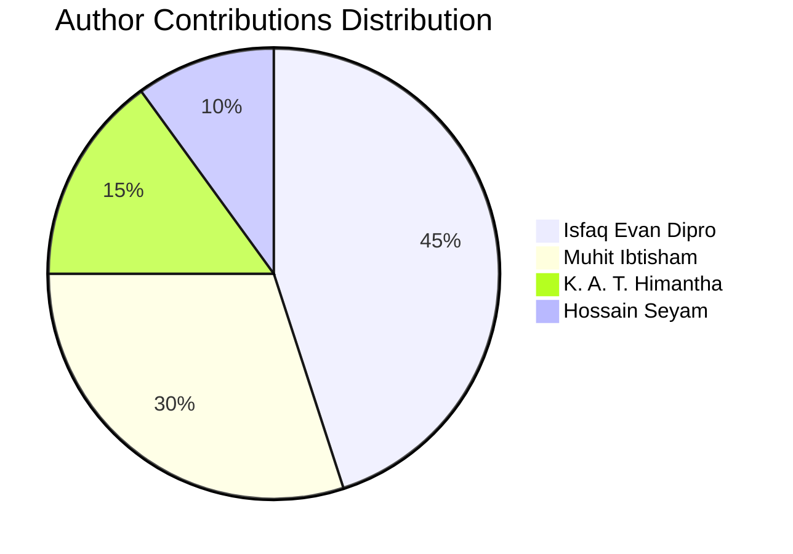

### Author Contribution Details:
```mermaid
graph TB
    subgraph "Isfaq Evan Dipro (45%)"
        A1[Full Codebase Development]
        A2[Face Recognition System]
        A3[OTP Implementation]
        A4[Front-end/Back-end Architecture]
    end
    
    subgraph "Muhit Ibtisham (30%)"
        B1[Model Training & Optimization]
        B2[Research Paper Writing]
        B3[Project Coordination & Testing]
    end
    
    subgraph "K. A. T. Himantha (15%)"
        C1[Research Data Collection]
        C2[Training Data Preparation]
        C3[Data Organization]
    end
    
    subgraph "Hossain Seyam (10%)"
        D1[Research Data Collection Support]
        D2[Presentation Materials]
    end
    
    A1 --> E[Complete System]
    A2 --> E
    A3 --> E
    A4 --> E
    B1 --> F[Optimized Performance]
    B2 --> G[Research Documentation]
    C1 --> H[Quality Dataset]
    D1 --> I[Supporting Materials]
```

### Contribution Breakdown Table:
| Author | Contribution Area | Specific Responsibilities | Percentage |
|--------|------------------|---------------------------|------------|
| **Isfaq Evan Dipro** | Development | Full codebase, face recognition, OTP system, architecture | 45% |
| **Muhit Ibtisham** | Research & Optimization | Model training, paper writing, coordination, testing | 30% |
| **K. A. T. Himantha** | Data Management | Research collection, data preparation, organization | 15% |
| **Hossain Seyam** | Support | Data collection support, presentation materials | 10% |

## System Summary

### Key Achievement Metrics:
```
┌─────────────────────────────────────────────────┐
│            FaceSignIn System Summary            │
├─────────────────────────────────────────────────┤
│  ✅ Web-based biometric authentication          │
│  ✅ Two-factor security (face + OTP)           │
│  ✅ 90-95% recognition accuracy                 │
│  ✅ <2% false acceptance rate                   │
│  ✅ Automated retraining system                 │
│  ✅ Suitable for academic/small-scale deployment│
└─────────────────────────────────────────────────┘
```

### Deployment Suitability Analysis:
```
Target Deployment Environments:
┌──────────────────────┬────────────┬──────────────────┐
│ Environment          │ Suitability│ Recommended Scale │
├──────────────────────┼────────────┼──────────────────┤
│ Academic Institutions│ ██████████ │ Up to 500 users  │
│ Small Organizations  │ █████████░ │ Up to 200 users  │
│ Research Laboratories│ ██████████ │ Up to 50 users   │
│ Enterprise           │ ███░░░░░░░ │ Not recommended  │
└──────────────────────┴────────────┴──────────────────┘
```
