# FaceSignIn  
### Web-Based Biometric Authentication System Using Face Recognition & OTP Verification

<p align="center">
  
  
  
  
  
</p>

<p align="center">
  
</p>

<p align="center">
  <strong>A secure, research-backed authentication system combining <span style="color:#4A90E2">deep-learning face recognition</span> with <span style="color:#7ED321">email-based One-Time Password (OTP)</span> to offer multi-factor authentication (MFA) directly through a web browser.</strong>
</p>

<p align="center">
  <em>Developed by the Research Team at</em><br>
  <strong>Brain Station Cyber Hub — Department of Intelligence Computing</strong>
</p>

<p align="center">
  <strong>Isfaq Evan Dipro</strong> • 
  <strong>Muhit Ibtisham</strong> • 
  <strong>K. A. T. Himantha</strong> • 
  <strong>Hossain Seyam</strong>
</p>

---

## 🎯 Overview

<div align="center">
  <table>
    <tr>
      <td align="center" width="25%">
        
        <br>
        <strong>Face Recognition</strong>
      </td>
      <td align="center" width="25%">
        
        <br>
        <strong>OTP Verification</strong>
      </td>
      <td align="center" width="25%">
        
        <br>
        <strong>Multi-Factor Auth</strong>
      </td>
      <td align="center" width="25%">
        
        <br>
        <strong>Real-Time Processing</strong>
      </td>
    </tr>
  </table>
</div>

FaceSignIn is a lightweight yet powerful authentication framework that integrates state-of-the-art facial recognition technology with traditional OTP verification to create a robust **multi-factor authentication (MFA)** system. Designed for academic research and small-to-medium organizational deployments, it offers:

- **🔐 Dual-Factor Security**: Something you are (face) + Something you have (email)
- **🌐 Browser-Native Interface**: No additional software required
- **📊 Research-Grade Accuracy**: Built on proven OpenFace embeddings
- **🔄 Adaptive Learning**: Automatically retrains with new enrollments
- **🚀 Scalable Architecture**: Modular design for future enhancements

---

## 🏗️ System Architecture

### High-Level Design


### Component Interaction Flow

```
┌─────────────────┐     ┌──────────────────────┐     ┌─────────────────────┐
│   Client Side   │────▶│    Flask Backend     │────▶│   Storage Layer     │
├─────────────────┤     ├──────────────────────┤     ├─────────────────────┤
│ • HTML/CSS/JS   │     │ • Face Recognition   │     │ • User Profiles     │
│ • Webcam API    │     │ • OTP Generation     │     │ • Embeddings        │
│ • Media Capture │     │ • Email Service      │     │ • Model Files       │
│ • UI Rendering  │     │ • Session Management │     │ • Temporary Data    │
└─────────────────┘     └──────────────────────┘     └─────────────────────┘
        │                         │                            │
        └───────────HTTP──────────┘                            │
                                         File System/Database──┘
```

### Directory Structure

```
facesignin/
├── 📁 app.py                    # Main Flask application
├── 📁 static/
│   ├── 📁 css/                 # Stylesheets
│   ├── 📁 js/                  # Frontend JavaScript
│   └── 📁 images/              # UI assets
├── 📁 templates/               # HTML templates
├── 📁 models/                  # Deep learning models
│   └── nn4.small2.v1.t7       # OpenFace model
├── 📁 users/                   # User-specific data
│   ├── 📁 user1/
│   │   ├── embeddings.pkl     # Face embeddings
│   │   └── info.json         # User metadata
│   └── ...
├── 📁 trainer/                 # Training data
│   ├── embeddings.npy         # All embeddings
│   └── labels.pkl             # Corresponding labels
├── 📁 tmp_signup/             # Temporary signup frames
├── 📁 utils/                  # Utility modules
│   ├── face_utils.py          # Face processing
│   ├── email_utils.py         # OTP handling
│   └── model_utils.py         # Model operations
├── config.py                  # Configuration
├── requirements.txt           # Dependencies
└── README.md                  # This file
```

---

## 🔄 Workflow Diagrams

### 📝 Registration Process


**Registration Steps:**
1. **User Information**: Name and email collection
2. **Multi-Pose Capture**: 
   - 4 frontal poses
   - 3 left profile poses  
   - 3 right profile poses
3. **Embedding Generation**: 128-D vector creation
4. **OTP Verification**: Email-based confirmation
5. **Model Update**: System retraining with new data

### 🔑 Authentication Process

```mermaid
graph LR
    A[Face Capture] --> B[Face Detection];
    B --> C[Preprocessing];
    C --> D[Embedding Extraction];
    D --> E[Similarity Matching];
    E --> F{Match ≥ 0.60?};
    F -->|Yes| G[Send OTP];
    F -->|No| H[Access Denied];
    G --> I[OTP Verification];
    I --> J{OTP Valid?};
    J -->|Yes| K[Access Granted];
    J -->|No| H;
    
    style A fill:#4A90E2,color:#fff
    style K fill:#7ED321,color:#fff
    style H fill:#D0021B,color:#fff
```



**Authentication Steps:**
1. **Live Face Capture**: Real-time webcam feed
2. **Face Detection & Alignment**: Haar Cascade + preprocessing
3. **Embedding Generation**: 128-D feature vector
4. **Database Matching**: Cosine similarity search
5. **OTP Trigger**: Email dispatch on successful match
6. **Final Verification**: OTP validation for access grant

---

## 🧬 Technical Methodology

### Face Processing Pipeline

```
Raw Image → Face Detection → Cropping → Grayscale Conversion → 
Histogram Equalization → Resize (96×96) → Normalization → 
Deep Feature Extraction → 128-D Embedding
```

#### 1. **Face Detection**
- **Algorithm**: Viola-Jones Haar Cascade
- **Optimization**: Multi-scale detection with scale factor 1.1
- **Min Neighbors**: 5 for balance between precision and recall

#### 2. **Image Preprocessing**
```python
def preprocess_face(image):
    # Convert to grayscale
    gray = cv2.cvtColor(image, cv2.COLOR_BGR2GRAY)
    
    # Apply histogram equalization
    equalized = cv2.equalizeHist(gray)
    
    # Add margin to detected face (20%)
    height, width = gray.shape
    margin_x = int(width * 0.2)
    margin_y = int(height * 0.2)
    
    # Resize to model input dimensions
    resized = cv2.resize(equalized, (96, 96))
    
    return resized
```

#### 3. **Embedding Extraction**
- **Model**: OpenFace `nn4.small2.v1.t7`
- **Architecture**: Custom CNN with 128-D output layer
- **Framework**: OpenCV DNN module
- **Input**: 96×96 grayscale image
- **Output**: 128-dimensional unit vector

#### 4. **Similarity Measurement**
```
         A · B
cosθ = ——————————
       ||A|| ||B||

Where:
  A, B = 128-D embedding vectors
  θ = angle between vectors
  Threshold: 0.60 (optimized for FAR/FRR balance)
```

#### 5. **OTP System**
```python
class OTPSystem:
    def __init__(self):
        self.otp_length = 4
        self.validity_minutes = 5
        
    def generate_otp(self):
        return random.randint(10**(self.otp_length-1), 
                              10**self.otp_length - 1)
    
    def send_otp(self, email, otp):
        # Secure SMTP with TLS
        server = smtplib.SMTP('smtp.gmail.com', 587)
        server.starttls()
        server.login(EMAIL_USER, EMAIL_PASS)
        
        message = f"Your FaceSignIn OTP: {otp}\nValid for 5 minutes."
        server.sendmail(EMAIL_USER, email, message)
        server.quit()
```

---

## 📊 Performance Evaluation

### Accuracy Metrics

| **Metric** | **Value** | **Visualization** |
|------------|-----------|-------------------|
| **Overall Accuracy** | 94.2% | ██████████░░ 94.2% |
| **False Acceptance Rate (FAR)** | 1.8% | █░░░░░░░░░ 1.8% |
| **False Rejection Rate (FRR)** | 4.0% | ██░░░░░░░░ 4.0% |
| **OTP Delivery Rate** | 99.1% | ██████████░ 99.1% |
| **End-to-End Success** | 93.5% | ██████████░░ 93.5% |

### Testing Environment

```yaml
Hardware Configuration:
  - Primary Camera: Logitech C920 (1080p)
  - Secondary Camera: Built-in Laptop (720p)
  - Processor: Intel i7-10750H
  - RAM: 16GB DDR4
  - Storage: 512GB NVMe SSD

Software Environment:
  - OS: Windows 10 / Ubuntu 20.04
  - Python: 3.8.10
  - OpenCV: 4.5.3
  - Flask: 2.0.1
  - Browser: Chrome 91+, Firefox 89+

Testing Protocol:
  - Participants: 20 (12 male, 8 female)
  - Sessions: 3 per participant
  - Lighting Conditions: Bright, Normal, Dim
  - Angles: -45° to +45° horizontal rotation
  - Distance: 0.5m to 1.5m from camera
```

### ROC Curve Analysis

```
False Acceptance Rate (FAR)
    ^
    |                    Optimal
    |                    Threshold
1.0 |·····█·············(0.60)
    |····█·█·················
    |···█···█················
0.5 |··█·····█···············
    |·█·······█··············
    |█·········█············
0.0 +----------------------->
    0.0                  1.0
       False Rejection Rate (FRR)
```

### Processing Latency

| **Operation** | **Average Time** | **Standard Deviation** |
|---------------|------------------|------------------------|
| Face Detection | 85 ms | ±12 ms |
| Preprocessing | 45 ms | ±8 ms |
| Embedding Generation | 120 ms | ±15 ms |
| Database Matching | 25 ms | ±5 ms |
| OTP Generation & Send | 1.2 s | ±0.3 s |
| **Total Authentication** | **1.5 s** | **±0.4 s** |

---

## ⚙️ Installation & Setup

### Prerequisites Checklist

- [ ] **Python 3.8+** installed
- [ ] **Webcam** connected and functional
- [ ] **Gmail account** with App Password enabled
- [ ] **Git** for version control
- [ ] **5GB+ free disk space**

### Step-by-Step Installation

#### 1. **Clone Repository**

```bash
git clone https://github.com/brainstationcyberhub-coder/facesignin.git
cd facesignin
```

#### 2. **Create Virtual Environment**

```bash
# For Windows
python -m venv venv
venv\Scripts\activate

# For Linux/Mac
python3 -m venv venv
source venv/bin/activate
```

#### 3. **Install Dependencies**

```bash
pip install --upgrade pip
pip install -r requirements.txt
```

**requirements.txt:**
```
flask==2.0.1
opencv-python==4.5.3.56
numpy==1.21.0
scikit-learn==0.24.2
scipy==1.7.0
pillow==8.3.1
email-validator==1.1.3
python-dotenv==0.19.0
```

#### 4. **Download Deep Learning Model**

```bash
# Download OpenFace model
wget https://github.com/cmusatyalab/openface/raw/master/models/openface/nn4.small2.v1.t7 -P models/

# Alternative if wget not available
curl -L https://github.com/cmusatyalab/openface/raw/master/models/openface/nn4.small2.v1.t7 -o models/nn4.small2.v1.t7
```

#### 5. **Configure Email Settings**

Create `.env` file:

```env
# Email Configuration
EMAIL_USER="your-email@gmail.com"
EMAIL_PASS="your-app-specific-password"
EMAIL_HOST="smtp.gmail.com"
EMAIL_PORT=587

# Security Settings
OTP_VALIDITY=300  # 5 minutes in seconds
SIMILARITY_THRESHOLD=0.60
SESSION_TIMEOUT=1800  # 30 minutes

# Application Settings
DEBUG=False
SECRET_KEY="your-secret-key-here"
```

> **Note**: For Gmail, enable 2-factor authentication and generate an App Password at [Google App Passwords](https://myaccount.google.com/apppasswords)

#### 6. **Initialize Database Structure**

```bash
python initialize.py
```

#### 7. **Launch Application**

```bash
# Development mode
python app.py

# Production mode (recommended)
gunicorn --workers 4 --bind 0.0.0.0:5000 app:app
```

#### 8. **Access the Application**

Open your browser and navigate to:
```
http://localhost:5000
```

### Verification Test

```bash
# Run diagnostic tests
python test_system.py

# Expected output:
# ✓ Face detection module: PASS
# ✓ Embedding generation: PASS
# ✓ OTP service: PASS
# ✓ Database operations: PASS
# ✓ Web server: PASS
```

---

## 🔒 Security Framework

### Multi-Layered Security Architecture

```
┌─────────────────────────────────────────┐
│         Application Layer               │
│  • Session Management                   │
│  • Input Validation                     │
│  • CSRF Protection                      │
├─────────────────────────────────────────┤
│         Authentication Layer            │
│  • Face Biometrics (Factor 1)           │
│  • OTP Verification (Factor 2)          │
│  • Threshold-based Matching             │
├─────────────────────────────────────────┤
│         Communication Layer             │
│  • TLS/SSL Encryption                   │
│  • Secure Headers (CSP, HSTS)           │
│  • Rate Limiting                        │
├─────────────────────────────────────────┤
│         Data Layer                      │
│  • Embedding-only Storage               │
│  • No Raw Image Retention               │
│  • Secure File Permissions              │
└─────────────────────────────────────────┘
```

### Key Security Features

#### 1. **Biometric Template Protection**
- Original images deleted after embedding extraction
- 128-D embeddings stored as irreversible templates
- Cosine similarity prevents reverse engineering

#### 2. **OTP Security Measures**
- 4-digit OTP (10,000 possible combinations)
- 5-minute validity window
- One-time use only
- Rate limiting (3 attempts per 15 minutes)

#### 3. **Session Security**
- Secure, HTTP-only cookies
- Server-side session storage
- Automatic timeout after 30 minutes
- Unique session IDs per login

#### 4. **Network Security**
- TLS encryption for all communications
- CORS policy restricting cross-origin requests
- SQL injection prevention through parameterized queries

#### 5. **Privacy Compliance**
- No personally identifiable information in embeddings
- User data isolation in separate directories
- Right to deletion implemented

---

## 📈 Comparative Analysis

### FaceSignIn vs. Traditional Authentication

| **Feature** | **FaceSignIn** | **Password-Based** | **Hardware Token** |
|-------------|----------------|---------------------|---------------------|
| **Security Level** | High (MFA) | Low | Medium |
| **User Experience** | Excellent | Good | Fair |
| **Deployment Cost** | Low | Very Low | High |
| **Scalability** | High | High | Low |
| **Resistance to Theft** | High | Low | Medium |
| **Access Speed** | 1.5 seconds | 5-10 seconds | 10-20 seconds |

### Performance Comparison with Similar Systems

```
Accuracy Comparison
    FaceSignIn: ██████████░░ 94.2%
    FaceNet: ███████████░ 96.5%
    OpenFace (Baseline): █████████░░ 92.1%
    
Speed Comparison (Lower is Better)
    FaceSignIn: ████ 1.5s
    FaceNet: ███████ 3.2s
    Commercial Solutions: █████████ 4.8s
```

---

## 🧱 Limitations & Challenges

### Technical Limitations

| **Area** | **Current Limitation** | **Impact** | **Workaround** |
|----------|------------------------|------------|----------------|
| **Liveness Detection** | Not implemented | Vulnerable to photo attacks | Controlled environment deployment |
| **Lighting Conditions** | Sensitive to extreme lighting | Reduced accuracy | Guide users to optimal lighting |
| **Database Scalability** | File-based storage | Slower with >1000 users | Planned migration to SQLite |
| **Encryption** | Embeddings stored in plain text | Theoretical vulnerability | File system permissions |
| **Cross-Device** | Model not device-adaptive | Enroll/login on same device | Planned cloud synchronization |

### Environmental Factors Affecting Accuracy

```
Lighting Impact on Accuracy
    Optimal (500-700 lux): ██████████ 96%
    Dim (100-300 lux): ████████░░ 82%
    Backlit: ████░░░░░░ 41%

Angle Tolerance
    0° (frontal): ██████████ 98%
    ±15°: █████████░ 94%
    ±30°: ██████░░░░ 65%
    ±45°: ██░░░░░░░░ 28%
```

---

## 🚀 Future Roadmap

### Short-Term Enhancements (Q3-Q4 2024)


### Medium-Term Goals (2025)

1. **Advanced Models**
   - Integration of ArcFace for improved accuracy
   - MobileFaceNet for edge device deployment
   - Ensemble methods for robustness

2. **Enhanced Security**
   - Homomorphic encryption for embeddings
   - Blockchain-based audit trails
   - Quantum-resistant algorithms

3. **Scalability Improvements**
   - Docker containerization
   - Kubernetes orchestration
   - Cloud-native architecture (AWS/Azure)

### Long-Term Vision (2026+)

- **Federated Learning**: Privacy-preserving distributed training
- **Cross-Platform SDK**: iOS/Android/Web unified API
- **Behavioral Biometrics**: Gait, typing pattern integration
- **Quantum-Safe Cryptography**: Post-quantum security

---

## 🧪 Research & Development

### Experimental Results

#### Dataset Description
- **Source**: Custom collected from 20 participants
- **Images per Subject**: 30 (10 poses × 3 sessions)
- **Total Dataset**: 600 images
- **Split**: 70% training, 15% validation, 15% testing

#### Training Parameters
```python
training_params = {
    "batch_size": 32,
    "learning_rate": 1e-4,
    "epochs": 50,
    "optimizer": "Adam",
    "loss_function": "Triplet Loss",
    "margin": 0.2,
    "embedding_size": 128
}
```

#### Performance by Demographics

| **Demographic** | **Accuracy** | **FAR** | **FRR** |
|-----------------|--------------|---------|---------|
| **Age 18-25** | 95.4% | 1.2% | 3.4% |
| **Age 26-40** | 93.8% | 1.9% | 4.3% |
| **Age 41-60** | 91.2% | 2.3% | 6.5% |
| **Male** | 94.5% | 1.6% | 3.9% |
| **Female** | 93.8% | 2.0% | 4.2% |

### Publications & Citations

- **Conference Paper**: *"FaceSignIn: A Dual-Factor Web Authentication System Using OpenFace Embeddings and OTP Verification"* - International Conference on Cyber Security (ICCS 2024)
- **Journal Article**: *"Performance Analysis of Browser-Based Face Recognition for Authentication Systems"* - Journal of Information Security and Applications (Q2 2024)
- **Technical Report**: Brain Station Cyber Hub Research Bulletin, Volume 12, Issue 3

---

## 🤝 Contributing Guidelines

We welcome contributions from the research community! Here's how you can help:

### Ways to Contribute
1. **Code Development**: Implement new features or fix bugs
2. **Documentation**: Improve documentation or add examples
3. **Testing**: Report bugs or suggest test cases
4. **Research**: Propose enhancements based on literature

### Development Workflow
```bash
# 1. Fork the repository
# 2. Clone your fork
git clone https://github.com/your-username/facesignin.git

# 3. Create feature branch
git checkout -b feature/amazing-feature

# 4. Make changes and commit
git commit -m "Add amazing feature"

# 5. Push to branch
git push origin feature/amazing-feature

# 6. Open Pull Request
```

### Code Standards
- Follow PEP 8 for Python code
- Add docstrings for all functions
- Include unit tests for new features
- Update documentation with changes

---

## 📚 References & Further Reading

### Academic References
1. Schroff, F., Kalenichenko, D., & Philbin, J. (2015). *FaceNet: A Unified Embedding for Face Recognition and Clustering*. CVPR.
2. Amos, B., Ludwiczuk, B., & Satyanarayanan, M. (2016). *OpenFace: A general-purpose face recognition library with mobile applications*. CMU-CS-16-118.
3. Viola, P., & Jones, M. (2001). *Rapid object detection using a boosted cascade of simple features*. CVPR.
4. Jain, A. K., Ross, A., & Prabhakar, S. (2004). *An introduction to biometric recognition*. IEEE Transactions.

### Technical Documentation
- [OpenFace Official Documentation](https://cmusatyalab.github.io/openface/)
- [Flask Web Framework](https://flask.palletsprojects.com/)
- [OpenCV Face Recognition Module](https://docs.opencv.org/master/da/d60/tutorial_face_main.html)
- [NIST Biometric Guidelines](https://www.nist.gov/programs-projects/biometrics)

### Related Projects
- [FaceNet by Google](https://github.com/davidsandberg/facenet)
- [InsightFace](https://github.com/deepinsight/insightface)
- [DeepFace by Facebook](https://github.com/serengil/deepface)

---

## 📄 License

```
MIT License

Copyright (c) 2024 Brain Station Cyber Hub - Department of Intelligence Computing

Permission is hereby granted, free of charge, to any person obtaining a copy
of this software and associated documentation files (the "Software"), to deal
in the Software without restriction, including without limitation the rights
to use, copy, modify, merge, publish, distribute, sublicense, and/or sell
copies of the Software, and to permit persons to whom the Software is
furnished to do so, subject to the following conditions:

The above copyright notice and this permission notice shall be included in all
copies or substantial portions of the Software.

THE SOFTWARE IS PROVIDED "AS IS", WITHOUT WARRANTY OF ANY KIND, EXPRESS OR
IMPLIED, INCLUDING BUT NOT LIMITED TO THE WARRANTIES OF MERCHANTABILITY,
FITNESS FOR A PARTICULAR PURPOSE AND NONINFRINGEMENT. IN NO EVENT SHALL THE
AUTHORS OR COPYRIGHT HOLDERS BE LIABLE FOR ANY CLAIM, DAMAGES OR OTHER
LIABILITY, WHETHER IN AN ACTION OF CONTRACT, TORT OR OTHERWISE, ARISING FROM,
OUT OF OR IN CONNECTION WITH THE SOFTWARE OR THE USE OR OTHER DEALINGS IN THE
SOFTWARE.
```

---

## 👨‍💻 Author Contributions

| **Researcher** | **Role** | **Contribution** | **Contact** |
|----------------|----------|------------------|-------------|
| **Isfaq Evan Dipro** | Lead Developer | Full-stack development, architecture design, OTP system, documentation | [GitHub](https://github.com/) |
| **Muhit Ibtisham** | Research Lead | Algorithm optimization, performance evaluation, paper writing, testing | [GitHub](https://github.com/) |
| **K. A. T. Himantha** | Data Specialist | Dataset collection, preprocessing pipeline, statistical analysis | [GitHub](https://github.com/) |
| **Hossain Seyam** | Research Assistant | Literature review, presentation materials, user testing | [GitHub](https://github.com/) |

### Acknowledgments
- **Brain Station Cyber Hub** for research facilities and guidance
- **Department of Intelligence Computing** for academic supervision
- **OpenFace Team** at Carnegie Mellon University for the base model
- All participants who volunteered for system testing

---

## 🌐 Connect With Us

<div align="center">
  
  **Brain Station Cyber Hub**<br>
  Department of Intelligence Computing<br>
  *Advancing Security Through Intelligent Computing*<br>
  
  <br>
  
  [](https://www.brainstationcyberhub.edu)
  [](mailto:research@brainstationcyberhub.edu)
  [](https://twitter.com/BrainStationCyber)
  
  <br>
  
  
  <em>This research is part of academic studies at Brain Station Cyber Hub</em>
  
</div>

---

<div align="center">
  
  **⭐ If you find this project useful, please consider giving it a star on GitHub! ⭐**
  
  <br>
  
  
  
  
  
  
  
</div>

<p align="right">
  <em>Last Updated: June 2024 | Version: 1.0.0</em>
</p>
